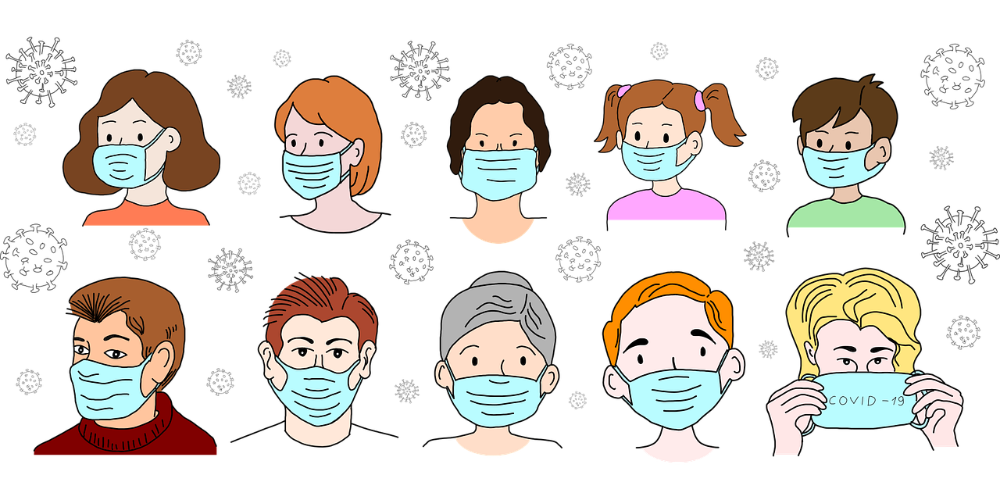

# pandemia
## covid
###  proteção

`A COVID-19 afeta diferentes pessoas de diferentes maneiras`
Portanto, o uso de **máscaras**é importante como medida de proteção tanto para você mesmo quanto para as pessoas a seu redor. As máscaras funcionam como uma barreira física para a liberação dessas gotículas no ar quando há tosse, espirros e até mesmo durante  [conversa](https://www.uol.com.br/vivabem/noticias/redacao/2020/09/29/conversas-normais-podem-espalhar-gotas-e-transmitir-virus-aponta-estudo.htm#:~:text=Os%20pesquisadores%20conclu%C3%ADram%20que%20conversas,v%C3%ADrus%20por%20uma%20dist%C3%A2ncia%20maior.)
Tipos de máscaras
* tecido
* cirúrgica
* Kn95

*Qual máscara escolher?*

|tipos | eficiência|
|-|-|
|tecido|boa|
|cirúrgica|otima|
|kn95|excelente|
